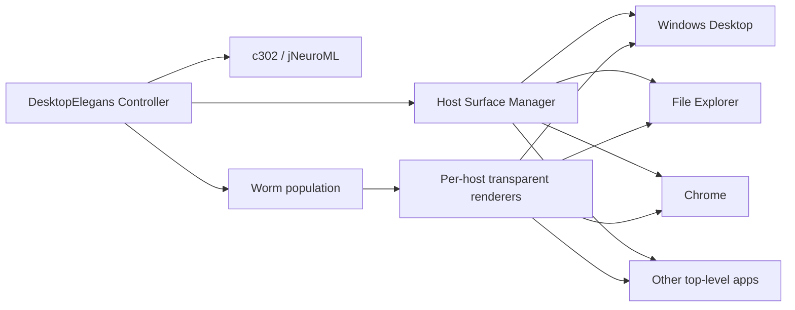

<div align="center">

# DesktopElegans

### A biologically inspired *C. elegans* that lives across your Windows desktop.

<p align="center">
  
  
  
  
</p>

<p align="center">
  
  
  
</p>

**DesktopElegans turns the Windows desktop into the organism's habitat.**  
Worms can inhabit the desktop and ordinary application windows, preserve identity as windows move or disappear, span multiple monitors, and remain click-through so the computer stays usable underneath them.

</div>

---

## Why DesktopElegans is different

Most desktop pets are sprites rendered in one always-on-top layer. DesktopElegans instead treats the operating system itself as an environment.

### Verified capabilities

| Area | Capability | Status |
|---|---|---|
| Habitat | Real desktop habitat | ✅ Verified |
| Habitat | Generic Win32 window habitats | ✅ Verified |
| Applications | File Explorer support | ✅ Verified |
| Applications | Chrome support | ✅ Verified |
| Displays | Multi-monitor / negative-coordinate layouts | ✅ Verified |
| Window lifecycle | Window move / resize tracking | ✅ Verified |
| Window lifecycle | Minimise / restore lifecycle | ✅ Verified |
| Window lifecycle | Host-close fallback to desktop | ✅ Verified |
| Rendering | Foreground-window occlusion | ✅ Verified |
| Rendering | Click-through / no-focus-steal rendering | ✅ Verified |
| Identity | Persistent worm identity across hosts | ✅ Verified |
| Population | Multiple simultaneous worms | ✅ Verified |
| Biology | c302 / jNeuroML-driven post-epoch wriggling | ✅ Verified |
| Scale | Approx. 1 mm production rendering | ✅ Verified |
| Packaging | One-click packaged Windows release | 🟡 Planned |

---

## The idea

DesktopElegans is a local desktop-organism simulation inspired by *Caenorhabditis elegans* and the OpenWorm/c302 ecosystem.

Instead of living inside a conventional game canvas, each simulated worm is managed by one controller and associated with a real Windows host surface. A host can be the desktop or an eligible top-level application window.

The result is a worm that appears to **live in Windows rather than on top of Windows**.



---

## Window behaviour

DesktopElegans uses real Win32 window state rather than treating the whole screen as one giant topmost overlay.

### Host ownership

A worm has one authoritative simulation identity and a current host surface.

When the host moves or resizes, the worm keeps its host-local coordinates and its screen position is recomputed.

When a host is minimised, the worm remains alive but its renderer is hidden.

When a host closes, the same worm can fall back to the desktop without being cloned or recreated.

### Occlusion and z-order

Application renderers are deliberately **not topmost**. They sit in normal Windows z-order, allowing unrelated foreground applications to cover them naturally.

The desktop renderer sits above the wallpaper but below ordinary applications.

### Input passthrough

Renderer windows are configured to avoid stealing normal interaction from the host underneath them.

Verified behaviour includes:

- mouse click passthrough
- keyboard input remaining with the host
- mouse-wheel passthrough
- no unexpected focus activation
- transparent hit testing

---

## Multi-monitor support

DesktopElegans works in the Windows virtual desktop coordinate space.

That means layouts with a monitor to the left of the primary display — and therefore negative X coordinates — are supported rather than assuming every display begins at `(0, 0)`.

Multiple worms can remain independently distributed across the workspace.

---

## Biology

DesktopElegans uses the **OpenWorm c302 / jNeuroML toolchain** for its neural simulation path.

The current verified build supports a connected flexible-body representation and visually confirmed post-c302 changes in body curvature, orientation and position.

Production rendering targets approximately **1 mm** at normal Windows DPI. Debug mode can enlarge the worm visually without changing simulation geometry.

> DesktopElegans is biologically inspired software, not a claim of a complete digital recreation of a living nematode.

---

## Quick launch

From PowerShell in the project directory:

```powershell
.\run.ps1
```

For an enlarged three-worm debug run:

```powershell
.\run.ps1 --initial-worms 3 --visual-debug-scale 20 --no-reproduction
```

### Runtime requirements

- Windows
- 64-bit Python 3.10
- Java 17+ for jNeuroML
- project Python dependencies

The controller can also detect a project-local Temurin Java runtime under:

```text
.runtime/tools/temurin17/*/bin/java.exe
```

---

## Verification

The current core milestone completed a clean canonical verification pass:

```text
49 / 49 tests PASS
config validation PASS
input passthrough PASS
Explorer lifecycle PASS
Chrome / desktop surface PASS
post-c302 visible wriggling CONFIRMED
```

See [docs/VERIFICATION.md](docs/VERIFICATION.md) for the verified behaviours and commands.

---

## Safety and scope

DesktopElegans is a **local visual desktop-organism simulation**.

It is not intended to self-propagate, infect processes, spread to other machines, inject code into unrelated applications, escalate privileges, or behave as malware.

Window-to-window movement in DesktopElegans means that the controller changes the worm's simulated host surface; the worm is **not copied into the target process**.

---

## Project structure

```text
src/nematode_mind/     core simulation and Windows integration
tests/                 automated regression tests
.runtime/              local smoke-test/runtime tooling
config.yaml            runtime configuration
run.ps1                normal Windows launch entry point
docs/                  architecture and verification notes
```

---

## Credits

DesktopElegans builds on ideas and tooling from the broader *C. elegans* modelling ecosystem, including:

- [OpenWorm](https://github.com/openworm)
- [c302](https://github.com/openworm/c302)
- [jNeuroML / NeuroML](https://github.com/NeuroML)

DesktopElegans is an independent project and is not presented as an official OpenWorm project.

---

## Contributing

Bug reports, reproducible Windows edge cases and focused pull requests are welcome.

Please read [CONTRIBUTING.md](CONTRIBUTING.md) before opening a pull request.

---

<div align="center">

### The operating system is the habitat.

</div>
