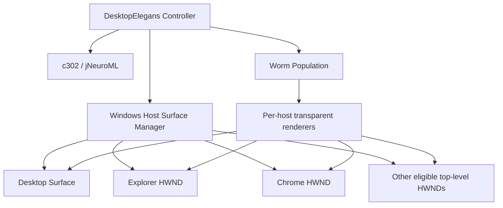

# DesktopElegans Architecture

## Overview

DesktopElegans is intentionally structured as **one trusted simulation/controller managing many worm entities**.

A worm does not become a separate operating-system process when it moves to another application. Instead, the controller updates the worm's current host surface and renders it through the corresponding transparent host renderer.

## Host surfaces

A host surface models the Windows location a worm currently inhabits.

Relevant state includes:

- host identity;
- HWND where applicable;
- client bounds in screen coordinates;
- visibility;
- minimised/restored state;
- monitor;
- z-order;
- process/title metadata;
- lifecycle across refreshes.

The surface manager filters transient or unsuitable top-level windows, including DWM-cloaked windows that are retained by the shell but are not genuinely visible habitats.

## Worm identity

Each worm has one authoritative simulation identity.

Changing hosts is a state transition, not replication.

When a host moves, DesktopElegans preserves the worm's host-local coordinates and recomputes screen position from the host's new bounds.

When a host disappears, the worm can fall back to the desktop while retaining the same identity.

## Rendering model

DesktopElegans does not use one giant globally topmost overlay.

Instead it maintains renderer windows for inhabited surfaces.

### Application renderers

Application-hosted renderers are independently managed and placed immediately above their host in normal, non-topmost z-order.

This design avoids a Win32 lifecycle problem where making a renderer a foreign-owned popup can interfere with the real application's ability to close.

### Desktop renderer

The desktop renderer is treated specially so it remains above the wallpaper/shell surface while ordinary applications can still cover it.

## Input behaviour

Renderer windows are intended to be visually present without becoming input targets.

The verified Windows path uses click-through and no-activation behaviour, including:

- `WS_EX_TRANSPARENT`;
- `WS_EX_NOACTIVATE`;
- `HTTRANSPARENT`;
- `MA_NOACTIVATE`.

This keeps normal mouse, keyboard and wheel input with the underlying application.

## Z-order and occlusion

The renderer is deliberately not `HWND_TOPMOST`.

That gives the desired visual model:

- a desktop worm disappears behind an application placed over it;
- a host worm remains visually attached to its application;
- an unrelated foreground window can cover that host worm;
- the worm does not float through every window simply because the renderer exists.

## Minimise / restore / close

### Minimise

The host remains modeled and the worm remains alive. Its renderer is withdrawn because there is no useful visible client area.

### Restore

The host geometry is refreshed and the existing worm becomes visible again.

### Close

The stale host and renderer are removed. The same worm identity is moved to a deterministic fallback surface, currently the desktop path used by the verified implementation.

## Multi-monitor coordinates

DesktopElegans uses Windows virtual-desktop coordinates.

The implementation must not assume the primary monitor begins at global `(0, 0)`; monitors may exist at negative X or Y coordinates.

This is essential for correctly preserving positions when application windows move across displays.

## Biological / visual separation

The c302 / jNeuroML path provides neural simulation input.

Body mechanics, host geometry and renderer scaling remain separate concerns.

Production rendering targets approximately 1 mm at normal DPI. Debug enlargement is visual-only and should not change collision or simulation geometry.

## Performance

Host enumeration is cached/throttled rather than performing an unnecessary full desktop scan for every visual update.

Destroyed HWNDs and renderer resources must be pruned promptly so long-running sessions do not accumulate stale surfaces.
